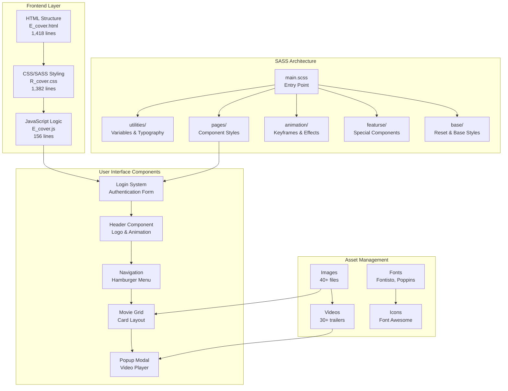
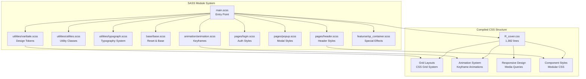
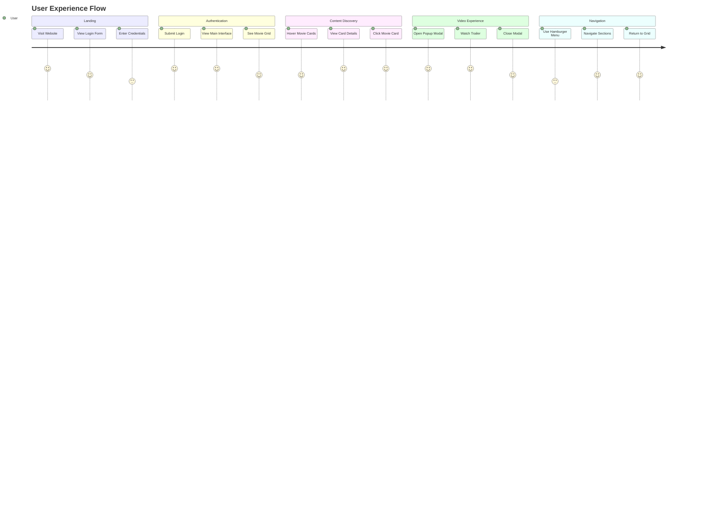
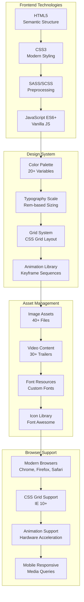
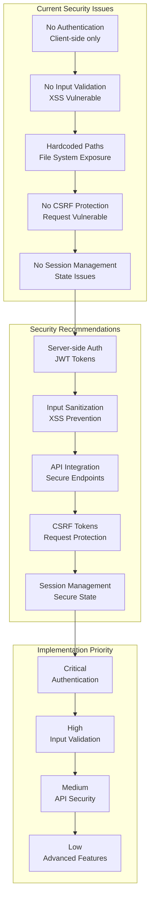
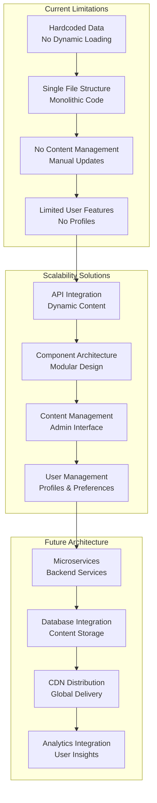

# Harish Bass Movie Streaming Platform - System Architecture Models

## 1. Overall System Architecture



## 2. Component Architecture Model

```mermaid
graph LR
    subgraph "Authentication Layer"
        A[Login Container] --> B[Form Validation]
        B --> C[Social Login<br/>Google/Yahoo]
        C --> D[Session Management]
    end
    
    subgraph "Main Application"
        E[Header Component] --> F[Logo Display]
        F --> G[Text Animation<br/>spin_4991 keyframes]
        G --> H[CTA Button]
    end
    
    subgraph "Navigation System"
        I[Hamburger Menu] --> J[Navigation Background]
        J --> K[Navigation Links]
        K --> L[Smooth Transitions]
    end
    
    subgraph "Content Display"
        M[Movie Cards Grid] --> N[Card Hover Effects]
        N --> O[Star Rating System]
        O --> P[Card Details Overlay]
    end
    
    subgraph "Video Management"
        Q[Video Object<br/>moviesvideo] --> R[Dynamic Source Switching]
        R --> S[Popup Video Player]
        S --> T[Video Controls]
    end
    
    D --> E
    H --> I
    L --> M
    P --> Q
    T --> U[Close Modal]
```



## 3. Data Flow Model

```mermaid
flowchart TD
    A[User Input<br/>Login Form] --> B{Validation}
    B -->|Valid| C[Show Main Interface]
    B -->|Invalid| D[Show Error Message]
    
    C --> E[Load Movie Grid]
    E --> F[Fetch Movie Data<br/>Hardcoded Object]
    F --> G[Render Movie Cards]
    
    G --> H[User Hover Event]
    H --> I[Show Card Details]
    
    G --> J[User Click Event]
    J --> K[Open Popup Modal]
    K --> L[Load Video Trailer]
    L --> M[Play Video]
    
    M --> N[User Close Event]
    N --> O[Close Modal]
    O --> G
    
    subgraph "Video Management System"
        P[moviesvideo Object] --> Q[String Matching<br/>popupvideoname()]
        Q --> R[Video Source Assignment]
        R --> S[Video Element Update]
    end
    
    L --> P
```

## 4. CSS/SASS Architecture Model



## 5. User Journey Model



## 6. Technical Stack Model



## 7. Performance Model

```mermaid
graph LR
    subgraph "Current Performance Issues"
        A[Large HTML File<br/>1,418 lines] --> B[Uncompressed CSS<br/>1,382 lines]
        B --> C[Multiple Video Files<br/>30+ simultaneous loads]
        C --> D[Large Images<br/>No optimization]
        D --> E[No Lazy Loading<br/>All assets loaded]
    end
    
    subgraph "Optimization Recommendations"
        F[Code Splitting<br/>Modular Architecture] --> G[CSS Minification<br/>Compressed Output]
        G --> H[Video Streaming<br/>Progressive Loading]
        H --> I[Image Compression<br/>WebP Format]
        I --> J[Lazy Loading<br/>On-demand Assets]
    end
    
    subgraph "Performance Metrics"
        K[Page Load Time<br/>Current: Slow] --> L[Asset Size<br/>Current: Large]
        L --> M[User Experience<br/>Current: Poor]
        M --> N[SEO Impact<br/>Current: Negative]
    end
    
    E --> F
    J --> K
```



## 8. Security Model



## 9. Scalability Model



## 10. Development Workflow Model

```mermaid
graph LR
    subgraph "Current Development Process"
        A[Manual SASS Compilation] --> B[Direct File Editing]
        B --> C[Browser Testing]
        C --> D[Manual Deployment]
    end
    
    subgraph "Recommended Workflow"
        E[Git Version Control<br/>Feature Branching] --> F[Automated Build<br/>SASS Compilation]
        F --> G[Code Linting<br/>Quality Checks]
        G --> H[Automated Testing<br/>Unit & Integration]
        H --> I[CI/CD Pipeline<br/>Automated Deployment]
    end
    
    subgraph "Quality Assurance"
        J[Code Reviews<br/>Peer Review] --> K[Performance Testing<br/>Load Testing]
        K --> L[Security Audits<br/>Vulnerability Scanning]
        L --> M[Accessibility Testing<br/>WCAG Compliance]
    end
    
    D --> E
    I --> J
```



## Model Summary

### Key Architectural Components:
1. **Frontend Layer**: HTML5, CSS3, SASS, JavaScript
2. **Component System**: Modular SASS architecture
3. **Asset Management**: Images, videos, fonts, icons
4. **User Interface**: Login, navigation, movie grid, popup modal
5. **Video System**: Dynamic video switching and playback

### Current State:
- **Architecture**: Single-page application with modular SASS
- **Performance**: Needs optimization for production
- **Security**: Requires immediate attention
- **Scalability**: Limited by hardcoded data structure

### Recommended Improvements:
1. **Security**: Implement proper authentication and validation
2. **Performance**: Add lazy loading and asset optimization
3. **Architecture**: Refactor to component-based structure
4. **Scalability**: Integrate with backend API and database

This model provides a comprehensive view of the current system architecture and serves as a blueprint for future development and improvements.

